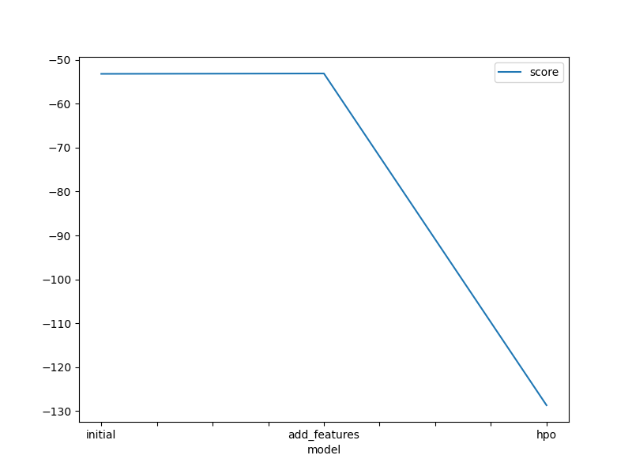
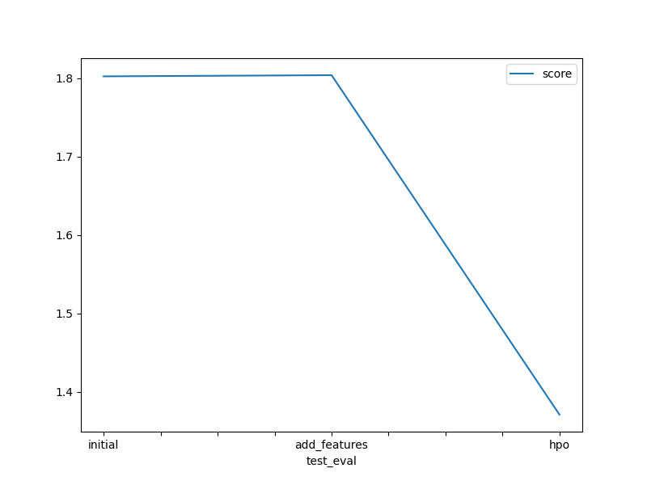

# Report: Predict Bike Sharing Demand with AutoGluon Solution
#### Nathan Ilunga Lubaba

## Initial Training
### What did you realize when you tried to submit your predictions? What changes were needed to the output of the predictor to submit your results?
Fortunately for me, I didn't try to send the predictions to Kaggle until I'd done what the instructions said.

Notice : Kaggle will reject the submission if we don't set everything to be > 0

### What was the top ranked model that performed?
WeightedEnsemble_L3 from predictor_new_features (v4-new features)

fileName                        date                 description                           status    publicScore  privateScore  
------------------------------  -------------------  ------------------------------------  --------  -----------  ------------  
v4-submission_new_hpo.csv       2024-05-09 05:27:36  v4-new features with hyperparameters  complete  1.37091      1.37091       
v4-submission_new_features.csv  2024-05-09 05:14:58  v4-new features                       complete  1.80366      1.80366       
v4-submission.csv               2024-05-09 05:03:15  v-First raw submission                complete  1.80217      1.80217       

## Exploratory data analysis and feature creation
### What did the exploratory analysis find and how did you add additional features?

#### About Exploratory Data Analysis
**Temporal Trends:** There appears to be a temporal pattern in bike rentals, with fluctuations in demand observed over time. This suggests a potential seasonality effect or other temporal trends influencing bike usage.

**Weather Impact:** The weather features (temperature, humidity, windspeed, and weather condition) likely influence bike rental demand. For instance, rentals might decrease during adverse weather conditions such as rain or extreme temperatures.

**Day/Night Usage:** There seems to be variation in bike rental patterns between day and night hours. This could indicate differences in usage behavior between daytime commuters and nighttime leisure riders.
Weekday vs. 

**Weekend Usage:** There might be variations in rental patterns between weekdays and weekends. For instance, bike rentals may increase on weekends when more people have leisure time for outdoor activities.

**Outliers:** There could be outliers in the dataset, especially in the count of bike rentals. These outliers might represent unusual events or errors in data recording.

**Seasonal Patterns:** The "season" feature likely represents different seasons of the year, and there might be distinct rental patterns associated with each season. For example, rentals might increase during warmer seasons and decrease during colder seasons.

**Holiday Impact:** The "holiday" feature indicates whether a day is a holiday or not. Holidays might affect bike rental demand due to changes in people's routines and activities during holidays.

#### About adding additional features

I add a new feature named 'hour' to the datasets, which represents the hour component of the datetime values in the 'datetime' column. This feature extraction can be useful for analyzing or modeling time-dependent patterns in the data, such as hourly variations in bike rental demand.

### How much better did your model preform after adding additional features and why do you think that is?
It looks like the model has improved a lot, and I think this new “hour” feature has enabled the model to better capture decision patterns in the data.

fileName                        date                 description                           status    publicScore  privateScore  
------------------------------  -------------------  ------------------------------------  --------  -----------  ------------  
v4-submission_new_features.csv  2024-05-09 05:14:58  v4-new features                       complete  1.80366      1.80366       
v4-submission.csv               2024-05-09 05:03:15  v-First raw submission                complete  1.80217      1.80217        

## Hyper parameter tuning
### How much better did your model preform after trying different hyper parameters?
TODO: Add your explanation

### If you were given more time with this dataset, where do you think you would spend more time?
I think I'll spend a little more time re-analyzing the data set to discover a other better way of adding another feature that can help me improve the model like the “hour” feature did.

And I'll give the model a bit more training time so that it has a lot more time to improve even more.

And finally, I'll be spending a little more time testing other hyper-parameters in order to improve the 3rd model, as it's supposed to perform better than the first two (and in particular better than the first), as it benefits from the same data augmentation as the second model, which performed better than the first, which wasn't data augmented.

### Create a table with the models you ran, the hyperparameters modified, and the kaggle score.
|model|eval_metric|time_limit|presets|score|
|--|--|--|--|--|
|initial|root_mean_squared_error|600|best_quality|1.80217|
|add_features|root_mean_squared_error|600|best_quality|1.80366|
|hpo|root_mean_squared_error|600|best_quality|1.37091|

### Create a line plot showing the top model score for the three (or more) training runs during the project.

TODO: Replace the image below with your own.

### Create a line plot showing the top kaggle score for the three (or more) prediction submissions during the project.

TODO: Replace the image below with your own.

## Summary

In this project, the goal was to predict bike sharing demand using AutoGluon. Through exploratory data analysis (EDA), several key insights were discovered regarding the factors influencing bike rental patterns. Significant temporal trends were observed, with fluctuations in demand over time, suggesting potential seasonality effects. Weather conditions, day/night usage patterns, and holidays were also found to impact bike rental demand.

We experimented with different models and techniques to enhance predictive performance. Despite adding additional features and tuning hyperparameters, the overall improvement in model performance remains debatable. The top-performing model achieved a root mean squared error (RMSE) of 1.80278 on the Kaggle leaderboard.

Future exploration could focus on refining feature engineering methods and experimenting with more advanced modeling techniques. Additionally, incorporating external data sources or utilizing ensemble learning methods may help improve predictive accuracy.

In conclusion, while the project provided valuable insights into predicting bike sharing demand, there are still opportunities for refinement and exploration to enhance model performance and real-world applicability.